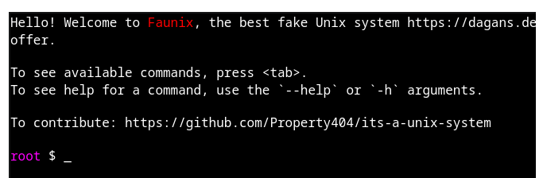
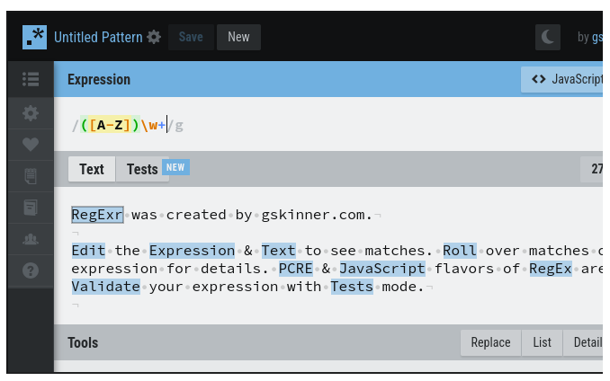
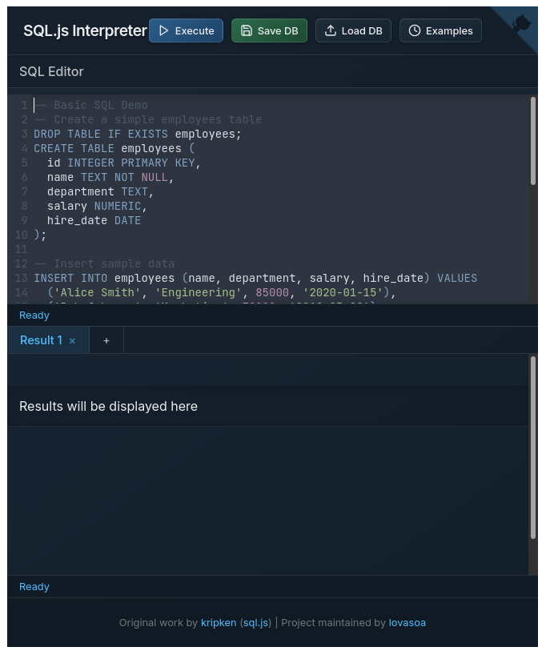

# lms-coding-widgets: A collection of interactive programming widgets for use in learning management systems (LMSs)

This project aims to provide some bookmarks for WebAssembly (WASM) coding widgets that run completely in the browser and thus requiring no backend. Copy-paste the widget codes below to use inside LMS assessments (quizzes, assignments, etc). They have been tested in the Desire2Learn (D2L) Brightspace system.

See the [web page version](https://cengique.github.io/lms-coding-widgets/#bash-terminal-editor) for live examples of the below Markdown `iframe`s.

Please cite this reference if you use them in your classes: 

> Cengiz Gunay (2026). "Lightweight and inexpensive interactive programming widgets for providing authentic coding assessment inside your LMS". Presented at the _2026 Annual CCSC:Southeastern (CCSC:SE) Conference_ at East Tennessee State University. October 23-24, 2026. 

## Contents

1. [R](#r-coding-widget- from-rdrrio)
1. [Bash](#bash-terminal-editor)
1. [Regular expressions](#regular-expressions)
1. [SQL](#sql)

## Examples

### R coding widget from `rdrr.io`

Can be accessed from [`rrdr.io` directly](https://rdrr.io/snippets/embed/), or you can use it in an `iframe`:

<iframe width="100%" height="400" src="https://rdrr.io/snippets/embed/" frameborder="0">
</iframe>

### Bash terminal editor

Live bash terminal provided by [its-a-unix-system](https://github.com/Property404/its-a-unix-system) with a [live demo](https://dagans.dev/projects/its-a-unix-system/dist/index.html). A [working example](tools/its-a-unix-system/index.html) is also included here.

You can use it in an `iframe` as well:

<iframe src="tools/its-a-unix-system/index.html" style="width: 800px;height: 600px;">
</iframe>

Other alternatives:
- [wasi-fs-access demo](https://wasi.rreverser.com/) by [Google Chrome Labs](https://github.com/GoogleChromeLabs/wasi-fs-access)
- [Wasmer + Ghostty-web](https://ghostty-web.wasmer.app/) by [wasmerio](https://github.com/wasmerio/webassembly.sh)
- [WebAssembly.sh](https://webassembly.sh/) by [Fermyon](https://developer.fermyon.com/wasm-languages/shell)

### Regular expressions

Regular expression execution and documentation and can be embedded from [`RegExr.com`](https://regexr.com/). Iframe code:

<iframe src="https://regexr.com/" width="800" height="400"></iframe>

Other alternatives:
- [Regex101.com](https://regex101.com/)

### SQL

SQL execution from [SQL.js.org](https://sql.js.org/examples/GUI/) with `iframe` code:

<iframe width="100%" height="800" src="https://sql.js.org/examples/GUI/" frameborder="0"></iframe>

Other alternatives:
- [DuckDB shell](https://shell.duckdb.org/)

